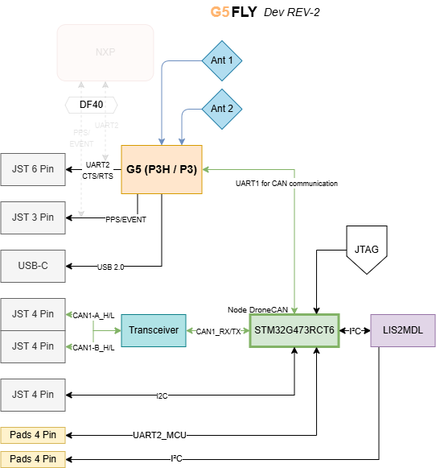

# G5Fly STM32G473 hardware design guide

This document is for contributors who need to understand or modify the STM32G473 hardware design.

## 1. Purpose of this document

Use this guide to locate the important hardware references, modify the KiCad project, and prepare a checked production release.

## 2. Project overview

G5Fly is a compact GNSS board built around the Septentrio Mosaic-G5 and an STM32G473RCT6. The STM32 runs the AP_Periph firmware configuration documented in [firmware/hwdef.md](firmware/hwdef.md) and communicates with the flight controller over DroneCAN.

## 3. Repository structure

Start with these locations:

- [hardware/versions/v1/kicad](hardware/versions/v1/kicad): the current KiCad project
- [hardware/versions/v1/kicad/production](hardware/versions/v1/kicad/production): available production exports
- [hardware/common/libraries](hardware/common/libraries): project symbols, footprints, and 3D models
- [hardware/common/design_rules/design-rules.md](hardware/common/design_rules/design-rules.md): track, via, and clearance values
- [Resources/G5Fly-schematics-STM32.pdf](Resources/G5Fly-schematics-STM32.pdf): STM32 schematic PDF
- [firmware/DroneCAN-Setup.md](firmware/DroneCAN-Setup.md): AP_Periph and DroneCAN bring-up guide
- [VERSIONING.md](VERSIONING.md): changes between hardware revisions

## 4. Hardware architecture

*STM32G473 architecture showing the Mosaic-G5, GNSS antennas, CAN transceiver, external interfaces, SWD/JTAG access, and the magnetometer. The faded DF40 block represents an optional extension and is not part of the STM32 base configuration documented in this branch.*

The STM32 schematic is the authoritative detailed reference for this branch: [G5Fly-schematics-STM32.pdf](Resources/G5Fly-schematics-STM32.pdf).

### 4.1 Main functional blocks

The following references are taken from the [G5Fly STM32 Rev2 BOM](hardware/versions/v1/kicad/production/G5Fly_STM32_Rev2_bom.csv):

| Function | Reference | Component / value | Role |
| --- | --- | --- | --- |
| GNSS receiver | `U1` | Septentrio mosaic-G5 | Main GNSS receiver |
| Microcontroller | `U4` | STM32G473RCT6 | Runs the AP_Periph firmware |
| Magnetometer | `U5` | LIS2MDLTR | Compass sensor connected through SPI1 |
| CAN transceiver | `U3` | TJA1462ATK | Physical-layer interface for DroneCAN/CAN |
| Main power regulator | `U8` | MPM3632CGQV-Z | Main switching regulator |
| Low-noise regulators | `U7`, `U12` | TPS7A9401DSCR | Low-noise regulated power rails |

### 4.2 Interfaces and configuration

The following interfaces and connector references are taken from the STM32 schematic and the [G5Fly STM32 Rev2 BOM](hardware/versions/v1/kicad/production/G5Fly_STM32_Rev2_bom.csv):

| Interface or function | Reference | Firmware mapping / component | Purpose |
| --- | --- | --- | --- |
| GNSS receiver and UART | `U1`, `J4` | `USART1`, `PA10` RX, `PA9` TX | Mosaic-G5 SBF input through the external serial connector |
| Debug UART | - | `USART2`, `PA3` RX, `PA2` TX | Temporary PC or Raspberry Pi debug port |
| CAN / DroneCAN | `U3`, `J6`, `J9` | `CAN1`, `PA11` RX, `PA12` TX | CAN physical layer and external DroneCAN connections |
| SWD programming and debug | - | `PA13` SWDIO, `PA14` SWCLK | Programming and debugging the STM32G473 |
| Magnetometer | `U5` | `SPI1`, `PA5` SCK, `PA6` MISO, `PA7` MOSI, `PA4` CS | LIS2MDLTR compass interface |
| External I2C | - | `I2C3`, `PA8` SCL, `PC9` SDA | External sensor or expansion interface |
| USB | `J3` | USB4105-GF-A | USB 2.0 communication and board power |
| GNSS antennas | `J10`, `J11` | MMCX-J-P-H-RA-TH1 | Main and auxiliary RF connections |
| Mezzanine expansion | `J8` | DF40TC(2.5)-50DS-0.4V(51) | Optional board-to-board connection; see the [DF40 connector image](Resources/Connector-DF40.png) |
| Reset | `SW1` | EVQP7J01P | Hardware reset input |

## 5. Modification workflow

### Step 1: Create a new hardware revision

Copy [hardware/versions/v1](hardware/versions/v1) to a new revision directory before making a hardware change. Keep released revisions unchanged. Record the change in [VERSIONING.md](VERSIONING.md).

### Step 2: Change the schematic first

Open `hardware/versions/v1/kicad/G5FLY.kicad_pro` and modify `G5FLY.kicad_sch` before editing the PCB. For every changed component, check its pin mapping, footprint, value, and datasheet. Pay particular attention to the GNSS RF path, STM32 pin assignment, UART connections, CAN transceiver, SWD header, and magnetometer interface.

### Step 3: Update and review the PCB

Update the PCB from the schematic, then review the board outline, connector orientation, antenna connectors, magnetometer orientation, copper clearances, and power paths. Do not replace project-library parts with global KiCad libraries; follow [Guidline.md](Guidline.md).

### Step 4: Run checks before export

Run ERC on the schematic and DRC on the PCB. Resolve errors, or document an intentional exception before continuing. Confirm that the schematic, PCB, BOM, and designators describe the same revision.

### Step 5: Prepare production files

Before sending the board for manufacturing, prepare:

- schematic export or PDF,
- KiCad project archive or source files,
- BOM,
- CPL/placement file,
- Gerbers and drill files,
- assembly notes for connectors, jumpers, and antennas.

	<strong>Tip:</strong> It is recommended to use the KiCad Fabrication Toolkit to extract the fabrication files, including the Fab BOM and CPL, in the format required for production by JLCPCB.

## 6. Checks specific to this board

### 6.1 RF and antenna layout

- keep the antenna path short and direct,
- keep switching and high-speed digital traces away from the GNSS RF path,
- keep the antenna path short and direct,
- keep switching and high-speed digital traces away from the GNSS RF path,
- verify antenna power and connector wiring directly against the STM32 schematic and the antenna datasheet.

The antenna supply is selected with `JP1`. Solder only the bridge required by the antenna specification:

<table>
	<tr>
		<td align="center"> <strong>3.3 V antenna</strong> Connect `VANT` to `+3.3V_RF`.</td>
		<td align="center"> <strong>5 V antenna</strong> Connect `VANT` to `+5V`.</td>
	</tr>
</table>

### 6.2 Power integrity

- preserve the existing separation between digital, RF, and low-noise regulated rails,
- verify the regulator ratings and output voltages after any power-tree change,
- check the USB and external 5 V paths for reverse-current or short-circuit risks,
- use the track widths and via sizes defined in [design-rules.md](hardware/common/design_rules/design-rules.md).

### 6.3 Mechanical integration

- preserve the 30.5 x 30.5 mm board outline unless creating a new derivative,
- confirm connector clearances from the STM32 schematic,
- keep the magnetometer clear of ferromagnetic parts and high-current paths,
- check connector access against the intended enclosure or frame.

## 7. Release checklist

Before sending a revision to production:

- confirm the revision identifier and update [VERSIONING.md](VERSIONING.md),
- run schematic ERC and PCB DRC,
- verify that every schematic component has a project-library symbol and footprint,
- verify that all 3D models use relative paths,
- compare the BOM and designator list with the final schematic and PCB,
- inspect the connectors, SWD access, CAN interface, GNSS interface, and antenna connections against the STM32 schematic,
- verify antenna power selection and connector orientation,
- generate Gerbers, drill files, Fab BOM, and CPL with the Fabrication Toolkit,
- open the generated files or use the manufacturer preview before ordering,
- record the validation result and any intentional exceptions.
