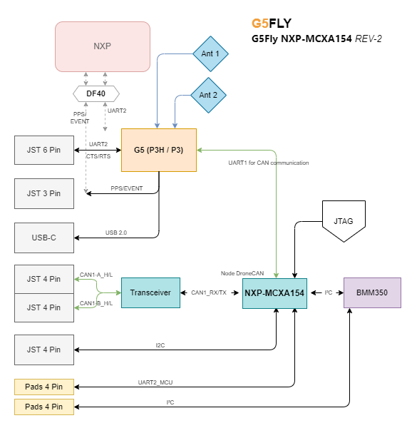

# G5Fly NXP-MCXA154 hardware design guide

This document is for contributors who need to understand or modify the NXP hardware design.

## 1. Purpose of this document

Use this guide to locate the important hardware references, modify the KiCad project, and prepare a checked production release.

## 2. Project overview

G5Fly is a 30.5 x 30.5 mm GNSS board built around the Septentrio mosaic-G5 and an NXP MCXA154. The MCXA154 is intended to run a user application built with Zephyr; no application firmware is supplied by default.

## 3. Repository structure

Start with these locations:

- [hardware/versions/v1/kicad](hardware/versions/v1/kicad): the current KiCad project
- [hardware/versions/v1/kicad/production](hardware/versions/v1/kicad/production): production exports
- [hardware/common/libraries](hardware/common/libraries): project symbols, footprints, and 3D models
- [hardware/common/design_rules/design-rules.md](hardware/common/design_rules/design-rules.md): track, via, and clearance values
- [Resources/G5Fly-schematics-NXP.pdf](Resources/G5Fly-schematics-NXP.pdf): schematic PDF
- [VERSIONING.md](VERSIONING.md): changes between hardware revisions

## 4. Hardware architecture

*Functional block diagram of the G5Fly NXP-MCXA154 REV-2, showing the Mosaic-G5 receiver, MCXA154, BMM350 magnetometer, CAN transceiver, antenna connections, and the main UART, I2C, PPS, USB, and expansion interfaces.*

### 4.1 Main functional blocks

The board can be understood through the following main components. Their references correspond to the [G5Fly NXP Rev-2 BOM](hardware/versions/v1/kicad/production/G5Fly_NXP_Rev-2_bom.csv):

| Function | Reference | Component | Role |
| --- | --- | --- | --- |
| GNSS receiver | `U1` | Septentrio mosaic-G5 | Main GNSS receiver |
| Microcontroller | `IC1` | NXP MCXA154VLH | Runs the Zephyr application |
| Magnetometer | `U4` | Bosch BMM350 | Magnetic-field measurement |
| CAN transceiver | `U3` | NXP TJA1462ATK | Physical-layer interface for DroneCAN/CAN |
| Main power regulation | `U8` | MPM3632CGQV-Z | Main switching regulator |
| Low-noise regulation | `U7`, `U12` | TPS7A9401DSCR | Low-noise regulated power rails |
| Antenna power selection | `JP1` | 3-position solder jumper | Selects antenna power between `+3.3V_RF` and `+5V` |

### 4.2 Connectors and configuration points

The board exposes the following connectors and configuration points. Their references correspond to the schematic and the [G5Fly NXP Rev-2 BOM](hardware/versions/v1/kicad/production/G5Fly_NXP_Rev-2_bom.csv):

| Interface or function | Reference | Connector or component | Role |
| --- | --- | --- | --- |
| PPS and event interface | `J1` | JST-SM03B-GHS | Ground, PPS input and event signal |
| GNSS serial interface | `J4` | JST-SM06B-GHS | GNSS UART, 5 V power and ground |
| Magnetometer interface | `J7` | JST-SM04B-GHS | I2C connection to the magnetometer or an external sensor |
| CAN interface | `J6`, `J9` | JST-SM04B-GHS | DroneCAN/CAN connection and power |
| Main GNSS antenna | `J10` | MMCX connector | Main antenna RF connection |
| Auxiliary GNSS antenna | `J11` | MMCX connector | Auxiliary antenna RF connection |
| USB | `J3` | USB-C receptacle | USB communication and board power |
| Mezzanine expansion | `J8` |  [DF40 board-to-board connector](Resources/Connector-DF40.png)| High-density expansion interface  |
| Programming and debug | `J5` | Tag-Connect TC2030 | SWD programming and debug access |
| Antenna power selection | `JP1` |  [3-position solder jumper](Resources/Vant-5V.png)| Selects antenna power between `+3.3V_RF` and `+5V` |
| Reset | `SW3` | Push button | Resets the MCXA154 |

## 5. Modification workflow

### Step 1: Create a new hardware revision

Copy [hardware/versions/v1](hardware/versions/v1) to a new revision directory before making a hardware change. Keep released revisions unchanged. Record the change in [VERSIONING.md](VERSIONING.md).

### Step 2: Change the schematic first

Open `hardware/versions/v1/kicad/G5FLY.kicad_pro` and modify `G5FLY.kicad_sch` before editing the PCB. For every changed component, check its pin mapping, footprint, value, and datasheet. Pay particular attention to the GNSS RF path, `VANT`, the MCXA154 pin assignment, the I2C magnetometer bus, and the CAN transceiver.

### Step 3: Update and review the PCB

Update the PCB from the schematic, then review the board outline, connector orientation, antenna connectors, magnetometer orientation, copper clearances, and power paths. Do not replace project-library parts with global KiCad libraries; follow [Guidline.md](Guidline.md).

### Step 4: Run checks before export

Run ERC on the schematic and DRC on the PCB. Resolve errors, or document an intentional exception before continuing. Confirm that the schematic, PCB, BOM, and designators describe the same revision.

### Step 5: Prepare production files

Before sending the board for manufacturing, prepare:

- schematic export or PDF,
- KiCad project archive or source files,
- BOM,
- CPL/placement file,
- Gerbers and drill files,
- assembly notes for connectors, jumpers, and antennas.

	<strong>Tip:</strong> It is recommended to use the KiCad Fabrication Toolkit to extract the fabrication files, including the Fab BOM and CPL, in the format required for production by JLCPCB.

## 6. Checks specific to this board

### 6.1 RF and antenna layout

- keep the antenna path short and direct,
- keep switching and high-speed digital traces away from the GNSS RF path,
- verify the two MMCX connectors (`J10` and `J11`) and their ground connection,
- antenna power is routed through pad 2 of `JP1` on the `VANT` net; `JP1` selects `+3.3V_RF` or `+5V`.

	<strong>Warning:</strong> JP1 must be soldered for the required antenna voltage. If the jumper is left open, the <code>VANT</code> net is not powered and an active antenna may not work, causing a significant loss of GNSS performance.

The solder bridge must connect the centre `VANT` pad to the voltage required by the antenna. Select only one configuration, according to the antenna datasheet:

<table>
	<tr>
		<td align="center"> <strong>3.3 V antenna</strong> Solder the bridge between `VANT` and `+3.3V_RF`.</td>
		<td align="center"> <strong>5 V antenna</strong> Solder the bridge between `VANT` and `+5V`.</td>
	</tr>
</table>

- verify the selected antenna voltage against the antenna datasheet before assembly.

### 6.2 Power integrity

- preserve the existing separation between digital, RF, and low-noise regulated rails,
- verify the ratings and output voltages of `U8`, `U7`, and `U12` after any power-tree change,
- check the USB and external 5 V paths for reverse-current or short-circuit risks,
- use the track widths and via sizes defined in [design-rules.md](hardware/common/design_rules/design-rules.md).

### 6.3 Mechanical integration

- preserve the 30.5 x 30.5 mm board outline unless creating a new derivative,
- confirm clearance around `J3`, `J8`, `J10`, and `J11`,
- keep the magnetometer clear of ferromagnetic parts and high-current paths,
- check connector access against the intended enclosure or frame.

## 7. Release checklist

Before sending a revision to production:

- confirm the revision identifier and update [VERSIONING.md](VERSIONING.md),
- run schematic ERC and PCB DRC,
- verify that every schematic component has a project-library symbol and footprint,
- verify that all 3D models use relative paths,
- compare the BOM and designator list with the final schematic and PCB,
- inspect `J3`, `J5`, `J6`, `J7`, `J8`, `J9`, `J10`, `J11`, `JP1`, and `SW3`,
- verify antenna power selection and connector orientation,
- generate Gerbers, drill files, Fab BOM, and CPL with the Fabrication Toolkit,
- open the generated files or use the manufacturer preview before ordering,
- record the validation result and any intentional exceptions.
