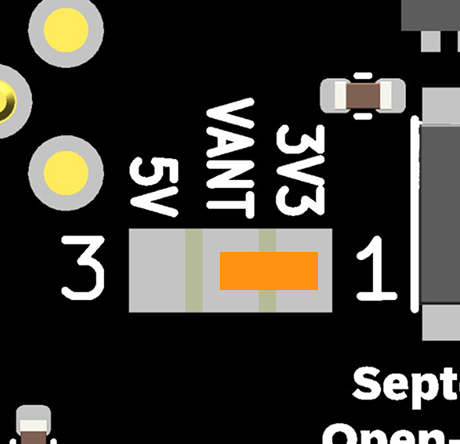
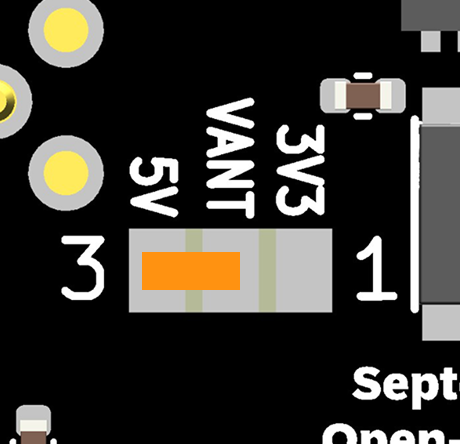

# G5Fly NXP-MCXA154

Open-source GNSS navigation board for drones and robotics.

G5Fly is a compact board built around the Septentrio Mosaic-G5 module for lightweight UAV, robotics, and navigation projects. The repository contains the hardware design files, firmware sources, and supporting documentation needed to use the board, manufacture it, or create a custom derivative.

Author: <a href="https://github.com/TheophileRaimbault">Théophile Raimbault</a> 
Maintainer: Septentrio GNSS GitHub user <githubuser@septentrio.com> 
External website: https://github.com/septentrio-gnss/G5Fly 
License: <a href="https://creativecommons.org/licenses/by-sa/4.0/">Creative Commons Attribution-ShareAlike 4.0</a> and <a href="https://www.oshwa.org/definition/">Open Source Hardware</a> 

  ℹ️ <strong>Note:</strong> G5Fly is optimized for a 30.5 x 30.5 mm FPV drone form factor and is intended for open source drone or robot projects.

 

 

## Who is this repository for?

This project serves two audiences:

- Users who want to buy, assemble, or use the board as-is.
- Designers who want to understand the hardware in detail and create a custom version.

If you are a user, start with the sections below. If you want to modify the design, go to [DESIGN.md](DESIGN.md).

## For users

### Key features
- Compact 30.5 x 30.5 mm FPV-friendly form factor
- Septentrio Mosaic-G5 GNSS receiver support
- USB and external 5 V power options
- DroneCAN, TTL, serial and I2C interfaces
- Reset input and status LEDs
- Mezzanine connection for the [NXP MCXN T1 hub](https://github.com/NXP-Robotics/mr_mcxn_t1_hub)

### Feature - Mezzanine integration with the NXP MCXN T1 hub

The G5Fly can be connected through its mezzanine interface to the [NXP MCXN T1 hub](https://github.com/NXP-Robotics/mr_mcxn_t1_hub). This provides a hardware expansion path for robotics applications. Refer to the [NXP integration HW-FW document](Resources/NXP%20integration%20HW-FW.pptx) for the hardware and firmware integration details.

  

### Quick start
1. Use the current production design files in [hardware/versions/v1/kicad/production](hardware/versions/v1/kicad/production/) if you want to build the board without changing the design.
2. Connect a suitable GNSS antenna and power the board through USB or an external 5 V source.
3. Develop and flash your application using the [Zephyr Project](https://www.zephyrproject.org/). No application software is currently provided by default.
4. Use the available UART, I2C, or DroneCAN interfaces depending on your integration target.
5. Validate the board with the status LEDs and the expected GNSS fix behavior before full integration.

### Antenna power selection
- Power can be supplied by USB or from an external 5 V rail.
- Active antennas must be powered at the voltage specified by the antenna manufacturer.

  <strong>Warning:</strong> Solder <code>JP1</code> before using an active antenna. If the jumper is left open, the <code>VANT</code> net is not powered and the antenna may not work, causing a significant loss of GNSS performance. Select only one voltage, according to the antenna datasheet.

<table>
  <tr>
    <td align="center"> <strong>3.3 V antenna</strong> Connect <code>VANT</code> to <code>+3.3V_RF</code>.</td>
    <td align="center"> <strong>5 V antenna</strong> Connect <code>VANT</code> to <code>+5V</code>.</td>
  </tr>
</table>

### Production and manufacturing
For a production build without hardware changes:

- Use the current KiCad project and generated manufacturing files from the hardware folder: [hardware/versions/v1/kicad](hardware/versions/v1/kicad/)
- Provide the manufacturer with the schematic, PCB files, BOM, and CPL.
- Verify antenna connector type, jumper configuration, and power options before assembly.
- Reference schematic: [Resources/G5Fly-schematics-NXP.pdf](Resources/G5Fly-schematics-NXP.pdf)

#### JLCPCB manufacturing requirements

- Keep the default KiCad PCB setup and its calculated impedance settings.
- Manufacture the board as a 6-layer PCB.
- `PCB Requirement: User.1 layer should be used as the V-cut guide layer.`
- Refer to the detailed [PCB rules](Resources/PCB_rules.png) when preparing or reviewing the PCB for production.
- For a production run at JLCPCB, use the [G5Fly_NXP_Rev-2_JLCPCB production archive](hardware/versions/v1/kicad/production/G5Fly_NXP_Rev-2_JLCPCB.zip), which contains the files prepared and previously submitted to JLCPCB for manufacturing.

### Power and antenna
- Keep GNSS antenna cables away from noisy power traces where possible.

### Recommended antenna options
The following antenna families are commonly considered for evaluation:

- D-Helix antenna HX-CHX600A
- D-Helix antenna HX-CH7609A
- HC990EXF Calian antenna

A SMA-to-MMCX adapter is often useful for compatibility with the board connector.

## For designers and contributors

The detailed hardware design guide is available in [DESIGN.md](DESIGN.md).

That document covers:
- Overall architecture and major blocks
- Component selection and board organization
- How to create a custom derivative board
- Manufacturing and validation recommendations
- Suggested workflows for changing the hardware safely

## Repository structure
- [hardware](hardware): PCB sources, KiCad projects, and mechanical assets
- [firmware](firmware): firmware and configuration files
- [Resources](Resources): images, schematics, and support documents
- [docs](docs): additional notes and guidance

## Licensing
This project is released under the Creative Commons Attribution-ShareAlike 4.0 license and follows the Open Source Hardware definition.
